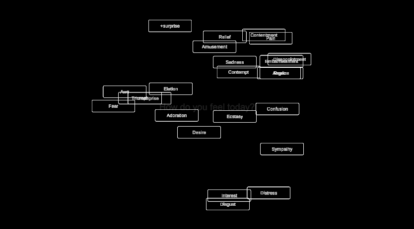

# Emotion Button Animation Project

## Overview

This Unity project is an interactive application where 24 emotion buttons are randomly instantiated on a canvas and animated within a defined boundary. Users can click on the buttons, and after four clicks, a mesh generation object is activated with a random seed and color. The buttons move randomly and are constrained within a circular area around the center of the canvas.

## Features

- **Random Button Instantiation**: Each of the 24 emotion buttons is instantiated at a random position within a specified radius from the center of the canvas.
- **Interactive Button Clicks**: After four button clicks, a `genMesh` object is activated with a randomized seed and material color.
- **Button Movement Animation**: The buttons move in random directions and bounce back when they reach the boundary of the allowed radius from the center.
- **Canvas Toggling**: When the `genMesh` object is activated, the canvas and buttons are hidden, and pressing the space bar brings the canvas back.

## Emotion Buttons

The 24 buttons represent various emotions, and each button has a unique label:

- Ecstasy
- Elation
- Triumph
- +surprise
- -surprise
- Amusement
- Contentment
- Sympathy
- Interest
- Realize
- Adoration
- Relief
- Desire
- Confusion
- Embarrassment
- Fear
- Distress
- Disgust
- Disappointment
- Contempt
- Pain
- Awe
- Anger
- Sadness

## How It Works

1. **Button Instantiation**:
    - The buttons are instantiated at random positions within a circular area defined by `maxDistanceFromCenter` around the center of the canvas.

2. **Button Movement**:
    - Once instantiated, the buttons move randomly within the boundary. If a button hits the boundary (defined by the radius from the center), it bounces back, reversing its velocity.

3. **Interaction**:
    - Users can click on the buttons, and after four button clicks, a mesh generation object (`genMesh`) is activated. This object has a random seed and material color, and the canvas with the buttons is hidden.
    - Pressing the space bar hides the `genMesh` object and brings the canvas back.

## Scripts

### `ButtonInteraction.cs`
This is the main script responsible for the behavior of the buttons and interaction with the mesh generation object. Key features include:
- Instantiation of buttons with random velocities.
- Random positioning of buttons within the boundary from the canvas center.
- Button click counting and mesh generation activation after four clicks.
- Random mesh seed and material color assignment.
- Button movement with boundary constraint and bouncing effect.

## Setup

1. Clone or download this project into your Unity workspace.
2. Ensure you have the following assets in your Unity project:
   - `ButtonPrefab`: A prefab of the button to instantiate.
   - `Canvas`: The canvas where the buttons will be instantiated.
   - `GenMesh`: A GameObject with a mesh generation script (`MeshGeneratorV1`).
   - `Material`: A material that will have its color randomized.
   
3. Drag the `ButtonPrefab`, `Canvas`, `GenMesh`, and `Material` references into the `ButtonInteraction` script in the Unity inspector.

## How to Use

1. **Play Mode**: Enter Unity’s Play Mode. You will see the emotion buttons randomly positioned around the center of the canvas.
2. **Interaction**:
   - Click on the buttons. After four clicks, the canvas will disappear, and the mesh object will activate with a random appearance.
   - Press the `Space` bar to bring the canvas back and reset the interaction.

## Assets

- **Cover Images**: 
   - `covera.png`
   - `coverb.png`

These are the two cover images located in the root folder that can be used for previews or promotional content.

## License

This project is licensed under the MIT License. You are free to use, modify, and distribute this project with attribution.
